# API и DTO сервиса инференса

Файл сформирован из FastAPI командой `python scripts/export_openapi.py`.
Изменяйте маршруты и Pydantic-модели, затем повторяйте экспорт.

Асинхронный GPU-инференс над parquet в S3. Любой под принимает заявки, свободный worker забирает их из общей очереди S3.

**Airflow:** подготовить вход → `POST /infer` → опрашивать `GET /tasks/{task_id}/status` → при `DONE` забрать результат в Hadoop.

**Статусы:** `QUEUED → RUNNING → FINALIZING → DONE`. Ошибка или таймаут переводит задачу в `FAILED`. Отмена: `QUEUED → ABORTED` или `RUNNING → ABORTING → ABORTED`.

Повтор HTTP-запроса использует прежний ключ идемпотентности. Новая попытка расчёта требует нового ключа и очищенного выходного префикса. Не удаляйте системный файл очереди. `FAILED` по таймауту не подтверждает остановку старого PUT: повтор в тот же физический путь не имеет строгой изоляции.

## Методы API

| Метод | Назначение | Тело запроса | Ответы |
| --- | --- | --- | --- |
| `POST /infer` | Поставить расчёт в очередь | InferRequest | `202` TaskAcceptedResponse `404` ErrorResponse `409` ErrorResponse `422` ErrorResponse `503` ErrorResponse |
| `GET /tasks/{task_id}/status` | Получить статус и прогресс расчёта | — | `200` TaskStatusResponse `503` ErrorResponse `404` ErrorResponse `422` HTTPValidationError |
| `POST /tasks/{task_id}/abort` | Запросить отмену расчёта | — | `200` TaskAbortResponse `503` ErrorResponse `404` ErrorResponse `409` ErrorResponse `422` HTTPValidationError |
| `GET /tasks/active` | Получить все незавершённые задачи | — | `200` ActiveTasksResponse `503` ErrorResponse |
| `GET /healthz/liveness` | Проверить работу потоков пода | — | `200` HealthResponse `503` HealthResponse |
| `GET /healthz/readiness` | Проверить готовность пода | — | `200` HealthResponse `503` HealthResponse |
| `GET /health` | Проверить состояние сервиса | — | `200` HealthResponse `503` HealthResponse |

## Структуры данных

В UML показаны поля и типы. `null` означает допустимое пустое значение,
а обязательность присутствия поля указана отдельно в таблице.
Диаграммы отображаются в просмотрщике Markdown с поддержкой Mermaid.

- [ActiveTaskSummary](#activetasksummary)
- [ActiveTasksResponse](#activetasksresponse)
- [ErrorResponse](#errorresponse)
- [HTTPValidationError](#httpvalidationerror)
- [HealthResponse](#healthresponse)
- [InferRequest](#inferrequest)
- [TaskAbortResponse](#taskabortresponse)
- [TaskAcceptedResponse](#taskacceptedresponse)
- [TaskStatus](#taskstatus)
- [TaskStatusResponse](#taskstatusresponse)
- [ValidationError](#validationerror)

### ActiveTaskSummary

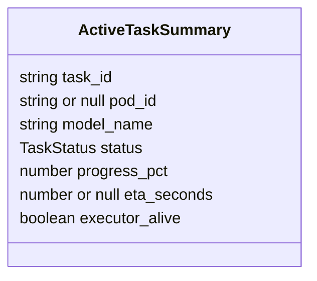

| Поле | Тип | Обязательно | Описание | Примеры и ограничения |
| --- | --- | --- | --- | --- |
| `task_id` | `string` | да | Идентификатор задачи | — |
| `pod_id` | `string \| null` | да | Под-исполнитель, null до назначения | — |
| `model_name` | `string` | да | Имя модели | — |
| `status` | `TaskStatus` | да | Один из незавершённых статусов | — |
| `progress_pct` | `number` | да | Сохранённый прогресс в процентах | — |
| `eta_seconds` | `number \| null` | да | Оценка оставшихся секунд, если доступна | — |
| `executor_alive` | `boolean` | да | Признак актуального heartbeat исполнителя | — |

### ActiveTasksResponse

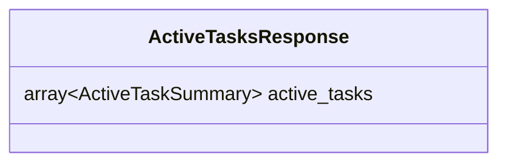

| Поле | Тип | Обязательно | Описание | Примеры и ограничения |
| --- | --- | --- | --- | --- |
| `active_tasks` | `array<ActiveTaskSummary>` | да | Незавершённые задачи всех подов | — |

### ErrorResponse

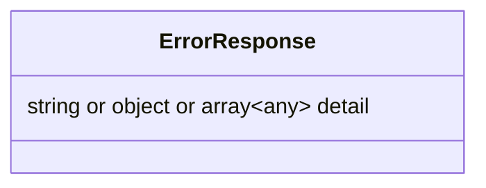

| Поле | Тип | Обязательно | Описание | Примеры и ограничения |
| --- | --- | --- | --- | --- |
| `detail` | `string \| object \| array<any>` | да | Сообщение ошибки, отсутствующие колонки или список ошибок валидации | — |

### HTTPValidationError

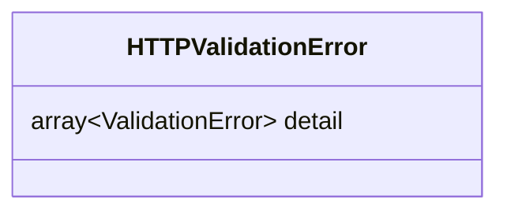

| Поле | Тип | Обязательно | Описание | Примеры и ограничения |
| --- | --- | --- | --- | --- |
| `detail` | `array<ValidationError>` | нет | — | — |

### HealthResponse

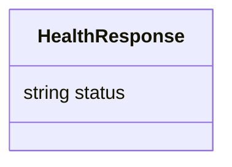

| Поле | Тип | Обязательно | Описание | Примеры и ограничения |
| --- | --- | --- | --- | --- |
| `status` | `string` | да | ok или unavailable | examples: ["ok"] |

### InferRequest

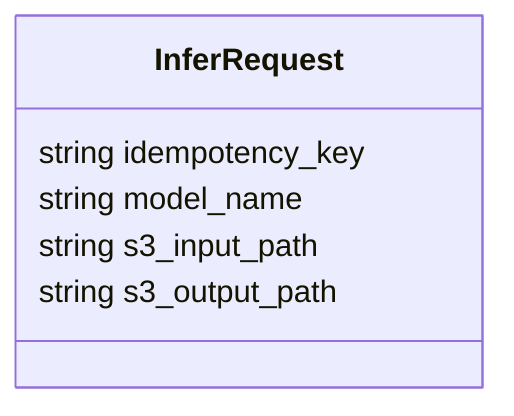

| Поле | Тип | Обязательно | Описание | Примеры и ограничения |
| --- | --- | --- | --- | --- |
| `idempotency_key` | `string` | да | Стабильный ключ одной попытки расчёта Airflow | examples: ["credit_cards/run-1/infer/attempt-1"]; minLength: 1; maxLength: 256 |
| `model_name` | `string` | да | Имя модели из configs/models.yaml | examples: ["credit_cards"]; minLength: 1 |
| `s3_input_path` | `string` | да | Входной префикс внутри S3_BUCKET_IN с подготовленными parquet | examples: ["s3://input-bucket/data/run-1"] |
| `s3_output_path` | `string` | да | Выходной префикс внутри S3_BUCKET_OUT без parquet и _SUCCESS | examples: ["s3://output-bucket/results/run-1"] |

### TaskAbortResponse

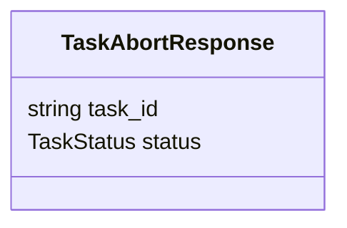

| Поле | Тип | Обязательно | Описание | Примеры и ограничения |
| --- | --- | --- | --- | --- |
| `task_id` | `string` | да | Идентификатор задачи | — |
| `status` | `TaskStatus` | да | Статус после запроса отмены. ABORTING требует ожидания | — |

### TaskAcceptedResponse

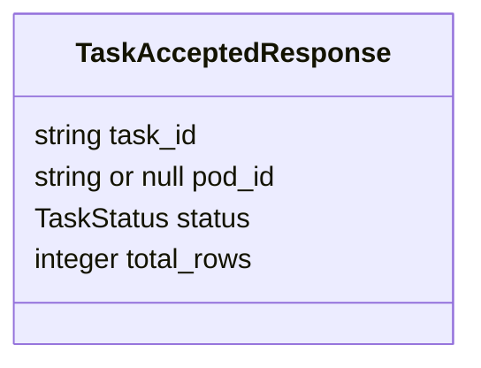

| Поле | Тип | Обязательно | Описание | Примеры и ограничения |
| --- | --- | --- | --- | --- |
| `task_id` | `string` | да | Идентификатор задачи для опроса статуса и отмены | — |
| `pod_id` | `string \| null` | да | Под-исполнитель, null до назначения | — |
| `status` | `TaskStatus` | да | Текущий статус, у новой заявки QUEUED | — |
| `total_rows` | `integer` | да | Количество строк во входных данных | — |

### TaskStatus

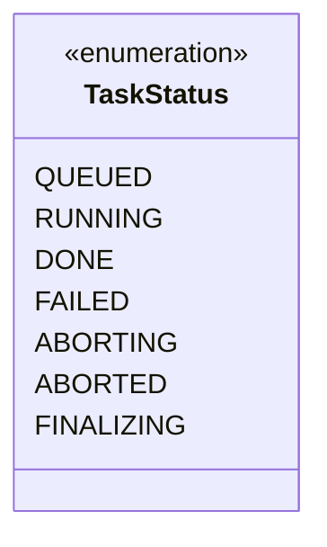

Значения: `QUEUED`, `RUNNING`, `DONE`, `FAILED`, `ABORTING`, `ABORTED`, `FINALIZING`.

### TaskStatusResponse

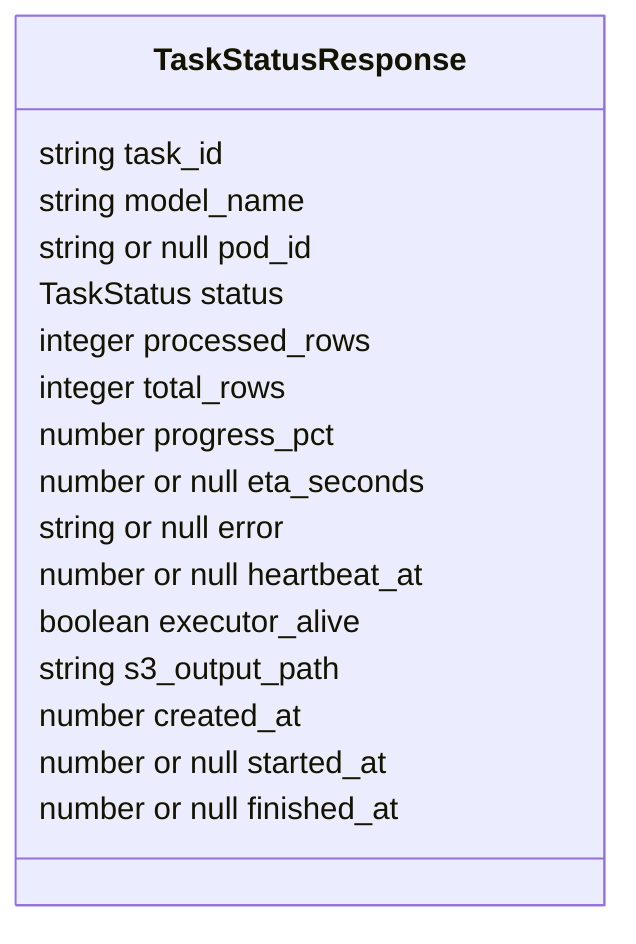

| Поле | Тип | Обязательно | Описание | Примеры и ограничения |
| --- | --- | --- | --- | --- |
| `task_id` | `string` | да | Идентификатор задачи | — |
| `model_name` | `string` | да | Имя модели из конфигурации | — |
| `pod_id` | `string \| null` | да | Назначенный под, null до захвата задачи | — |
| `status` | `TaskStatus` | да | DONE, FAILED и ABORTED — финальные статусы | — |
| `processed_rows` | `integer` | да | Количество обработанных строк по сохранённому прогрессу | — |
| `total_rows` | `integer` | да | Количество входных строк | — |
| `progress_pct` | `number` | да | Прогресс в процентах. 100 ещё не означает DONE | — |
| `eta_seconds` | `number \| null` | да | Оценка оставшихся секунд, null если недоступна | — |
| `error` | `string \| null` | да | Причина ошибки или таймаута, null при отсутствии | — |
| `heartbeat_at` | `number \| null` | да | Последний heartbeat: Unix timestamp в секундах | — |
| `executor_alive` | `boolean` | да | Признак актуального heartbeat, не проверка процесса | — |
| `s3_output_path` | `string` | да | Физический S3-префикс результата. Читать после DONE | — |
| `created_at` | `number` | да | Создание задачи: Unix timestamp в секундах | — |
| `started_at` | `number \| null` | да | Начало расчёта: Unix timestamp, null до старта | — |
| `finished_at` | `number \| null` | да | Завершение: Unix timestamp, null до завершения | — |

### ValidationError

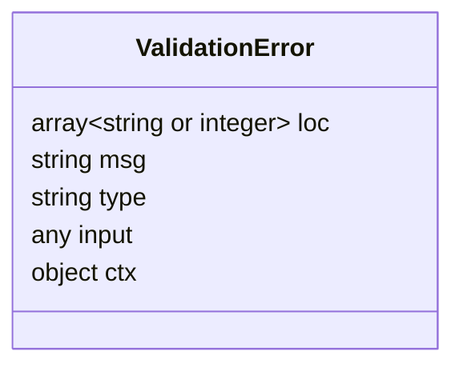

| Поле | Тип | Обязательно | Описание | Примеры и ограничения |
| --- | --- | --- | --- | --- |
| `loc` | `array<string \| integer>` | да | — | — |
| `msg` | `string` | да | — | — |
| `type` | `string` | да | — | — |
| `input` | `any` | нет | — | — |
| `ctx` | `object` | нет | — | — |
