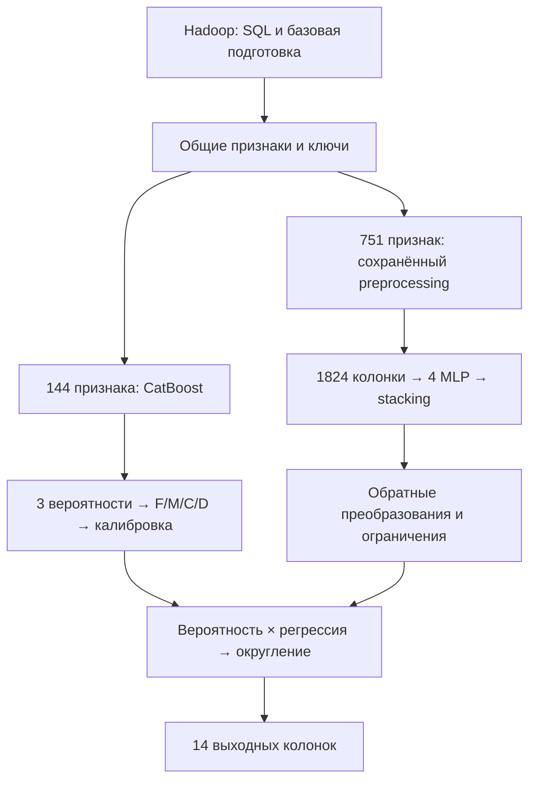

# FMCD_INVEST: разбор прототипа и предложение интеграции

Дата: 2026-09-13. Источники: 27 скриншотов ноутбука, в порядке времени
2026-09-02 14:33:30–14:43:25, и текущий код сервиса. Это анализ, не реализация модели.
Артефакты, полный input_query.sql и исполняемый ноутбук не предоставлены.
Числа ниже относятся к показанному запуску, а не к любому будущему набору артефактов.

## Главное отличие от описания «CatBoost, затем нейросеть»

В ноутбуке две вычислительные ветки выполняются последовательно, но скоры CatBoost
не входят в показанный вход нейросети. CatBoost даёт вероятности, нейросеть — четыре
регрессионных значения. Они объединяются в финале по ключам и перемножаются.
Внутри второй ветки есть отдельный stacking четырёх нейросетей и метасети.

## 1. Источники и общая подготовка — скриншоты 1–5

- Ключи: counterparty_id, report_dt. Вверху объявлены четыре target_names:
  sum_daily_diversity_2m, saldo_2m, consistency_2m, diversity_2m.
- fmcd_reference.xlsx фильтруется по is_applicable_for_modeling == "YES".
  Из modeling_type берутся списки numerical и categorical. В справочнике 17620
  выбранных строк, но в этих двух списках суммарно 17619: причина одного отличия не видна.
- CatBoost загружается из catboost_multilabel_model_v1_optimized.cbm;
  порядок признаков берётся из model.feature_names_. Выбрано 138 числовых и 6 категориальных.
- mrmr_report_v2.xlsx, фильтр in_final_selection == True, задаёт признаки второй
  модели: 686 числовых и 65 категориальных.
- Объединение двух списков: 759 числовых + 65 категориальных = 824 признака.
  С ключами в показанном DataFrame 826 колонок и 481455 строк.
- input_query.sql выполняется через spark.sql. Текст на скриншоте 5 обрезан,
  поэтому нельзя подтвердить источники, JOIN, условия отбора и весь список выражений.
- prepare_data_for_score выбирает поля справочника, чьё description начинается
  с «Частота», «Сальдо», «Диверсификация», «Факт», «Регулярность», «Средн», «Оборот»,
  и tags входит в brokerage_deals / invest_portfolio. Для пересечения с колонками
  входа заполняет пропуски нулём. Это не общее заполнение всех числовых признаков.
- После заполнения числовые признаки приводятся к double, категориальные — к string,
  ключи сохраняются. Порядок fill → cast следует сохранить при переносе.

load_data использует randomSplit на четыре части, toPandas для каждой и затем concat.
Это не потоковый pipeline: весь набор остаётся в памяти драйвера. В сервисе эту
часть заменяет существующее чтение Parquet чанками, без randomSplit и полного concat.

## 2. CatBoost и калибровка — скриншоты 6–7

1. Выбор ключей и model.feature_names_ в исходном порядке модели.
2. Пропуски категориальных признаков заменяются точной строкой "Special: Missings".
   Другие числовые пропуски этой ветки дополнительно не заполняются.
3. predict_proba возвращает результат, используемый так:
   F = predicts[:, 0], M = predicts[:, 1], C = predicts[:, 0], D = predicts[:, 2].
   Равенство исходных F/C явно присутствует в коде и подтверждено пользователем
   как намеренная логика моделистов. Название файла предполагает
   multilabel, но loss_function и фактический контракт модели без артефакта не проверены.
4. Для каждой буквы из calib_model_weights.json читаются w0 и w:

   p_calib = sigmoid(w0 + w * log(p / (1 - p))).

В ноутбуке нет clipping вероятностей перед logit. Поведение при p=0/1 необходимо
включить в эталонные проверки; добавление epsilon изменит математический результат.
F/C имеют одинаковые коэффициенты в показанном JSON-выводе, но источником параметров
должен оставаться артефакт, а не переписанные со скриншота числа.

## 3. Препроцессинг нейросети — скриншоты 8–15

feature_preprocessor.json задаёт num_cols, cat_cols, флаги включения этапов и
сохранённые params. stacking_training_config.json задаёт feature_columns.
Содержимое JSON не показано: наличие ветки в функции не доказывает, что она включена.

Порядок этапов фиксирован:

| Этап | Поведение |
| --- | --- |
| Пропуски | Числовой флаг `<column>_missing` создаётся до заполнения медианой из params.medians. Для категорий — missing_cat_value, fallback "Special missing value" |
| Winsorization | np.clip по сохранённым lower/upper; None означает отсутствие соответствующей границы |
| Преобразование | signed_log: sign(x)·log1p(abs(x)); asinh: arcsinh(x/scale); либо none |
| Масштабирование | robust: (x-center)/scale; minmax: clip((x-min)/scale, 0, 1); либо none |
| Категории | astype(str).str.strip(), далее label, one_hot или frequency по сохранённым параметрам |

Label: mapping, неизвестная категория → 0, int64. Frequency: freq_map,
неизвестная категория → 0.0, float32. One-hot: только ожидаемые ohe_columns,
отсутствующие заполняются нулём; неизвестные категории не добавляют новые колонки.

Затем проверяются отсутствующие/лишние признаки, числовые типы и пропуски,
фиксируется порядок feature_columns, всё приводится к float32. В показанном запуске
751 исходная колонка превращается в 1824. Без JSON нельзя точно разложить прирост
по missing-флагам и one-hot: это нельзя выводить только из итоговой размерности.

Важная зависимость: нули общей Spark-подготовки уже присутствуют на входе этого
этапа. Missing-флаги нельзя рассчитывать по исходному Hadoop-входу до этого заполнения.
Медианы, границы, словари и масштабы не пересчитываются на scoring-данных или шардах.

## 4. Нейросетевой инференс — скриншоты 16–26

FMCDSingleTargetNet строит отдельную MLP для F, M, C, D:
Linear → BatchNorm1d → GELU → Dropout; затем head из Linear → GELU → Linear,
с условной Sigmoid. В определении значения по умолчанию: backbone=(512,256,128),
head_dim=32, dropout=0.2. Фактические значения загружаются из model_init_params
в четырёх fmcd_nn_artifacts.json и могут отличаться.

FMCDSingleTargetStackingModel получает от каждой сети embedding и предсказание
в пространстве её выходной head, объединяет все embeddings, затем все предсказания.
Размер входа метасети — сумма head_dim четырёх сетей + 4; при head_dim=32 это 132,
но размер конкретных артефактов не подтверждён. Метасеть содержит BatchNorm,
Linear/GELU/Dropout и четыре выходные head. Default hidden_dims=(64,32).

load_single_target_model_artifact в показанном коде только создаёт архитектуру
из JSON. Веса всех базовых сетей и метасети загружаются общим load_state_dict из
experiments_stacking/artifacts/fmcd_stacking_best_state.pt. Код проверяет наличие
префиксов base_models.F/M/C/D. Поэтому отсутствие отдельных .pt базовых моделей
само по себе здесь не ошибка, если общий checkpoint действительно полный.

predict вызывает eval и no_grad; predict_stacking_frame подаёт float32 батчи по 4096.
В показанном запуске device=cpu. Возможность cuda предусмотрена прототипом,
но GPU-производительность и эквивалентность результатов этим запуском не доказаны.

После head сначала отменяется normalization (y*scale+center), затем target transform:
none/nb/zinb — без дополнительного преобразования; log1p — expm1 с нижней границей 0;
log1p_normalized — expm1(y*log1p_max) с нижней границей 0; sqrt — квадрат;
signed_log — sign(y)*expm1(abs(y)); asinh/asinh_quantile — scale*sinh(y).
Конкретные методы каждой буквы нужно прочитать из артефактов.

## 5. Финальный результат — скриншот 27

После обратных преобразований: F ограничивается снизу нулём, C диапазоном [0,62],
D диапазоном [0,13]. Дополнительного clipping для M в этой ячейке нет.
Далее inner merge веток по (counterparty_id, report_dt), умножение каждой регрессии
на соответствующую откалиброванную вероятность. F/C/D округляются np.round до
целых значений, M — до двух знаков. Явного преобразования F/C/D к integer нет.

Выход: 2 ключа + 4 исходные вероятности + 4 калиброванные вероятности +
f_pred, m_pred, c_pred, d_pred = 14 колонок. Промежуточные score_F/M/C/D не экспортируются.
Чтобы заменить merge обработкой одной строки/чанка без изменения результата,
нужно подтвердить уникальность составного ключа: дубли дают many-to-many merge.

## Рекомендация по SQL и размещению этапов

Первый вариант: Airflow → Hadoop SQL (отбор, типы, предусмотренные нули) → Parquet
в S3 → GPUModelInferenceOperator(model_name="FMCD_INVEST") → полный pipeline чанка
в сервисе → выходной Parquet. Две ветки обрабатывают один и тот же чанк; распределять
их по отдельным Airflow-задачам и делать промежуточную выгрузку пока не требуется.

Для SQL лучше сформировать явный, версионируемый список zero-fill колонок из
справочника и списки признаков из артефактов. 824 признака + ключи — ориентир
показанного запуска. Отбор по датам/клиентам можно описать лишь после получения SQL.

Обученные преобразования также выразимы в SQL: CASE, missing-флаги, арифметика,
границы, словари через JOIN/CASE, one-hot. Но на POC это создаёт вторую реализацию
препроцессора и расширяет передаваемый набор второй ветки до 1824 колонок, при этом
CatBoost всё равно требует собственных исходных признаков. Поэтому переносить их
стоит только по результатам измерений и проверки совпадения промежуточных значений.

NULL и NaN нельзя подменять одним COALESCE: в Spark это разные случаи, есть отдельная
NANVL. Сохраняйте порядок заполнения и cast, особенности строк, точные missing-токены,
rounding и типы. [Spark NULL semantics](https://spark.apache.org/docs/3.5.6/sql-ref-null-semantics.html),
[Spark built-in functions](https://spark.apache.org/docs/3.5.7/sql-ref-functions-builtin.html).

## Производительность

Пользователь подтвердил: замер относится только к инференсу нейросети.
Скриншот 26: nproc=128, wall time=3m11s, CPU total=12m10s. Измеряется вызов
predict_stacking_frame и добавление префикса score_, не preprocessing, CatBoost,
загрузка моделей, Hadoop или запись S3. 128 доступных логических CPU не означает,
что все они были загружены. Отношение CPU total / wall ≈ 3.8 CPU, при условии
обычной интерпретации таймера; это не профиль потоков и не вывод о масштабируемости.

Плотная матрица 481455×1824 float32 занимает около 3.51 GB (3.27 GiB) без накладных
расходов; копии DataFrame и создание torch.tensor увеличивают память. Предпочтительно
preprocess + обе модели + postprocess на чанке, затем немедленная запись результата.

Сравнить CPU-only и CatBoost CPU + нейросеть GPU на одинаковых данных и ресурсах.
Раздельно измерить чтение, preprocessing, CatBoost, NN, postprocess, запись и пик памяти.
Не переносить автоматически 120/128 CPU на под; фиксировать thread limits и batch size.
Число S3-шардов не определяет число исполнителей: текущий worker выполняет одну
задачу за раз на под, несколько подов могут обрабатывать разные шарды.

## Минимальный интерфейс модели

Текущий ModelBundle, loader, validation и run_inference_on_chunk жёстко связаны
с ProdSchema/FMCDModel и существующими формулами выходов. Один каталог уже поддержан
через artifacts_dir, но произвольный pipeline новым экземпляром конфига не подключить.

Предлагается небольшой BaseInferenceModel/Protocol:
- load(artifacts_dir, options, logger) — однократная загрузка на под;
- required_columns — входной контракт, включая ключи;
- predict_chunk(frame, batch_size, check_shutdown) — полный pipeline и выходной DataFrame;
- close() — опциональное освобождение ресурсов.

Реализации: LegacyFMCDModel и FMCDInvestModel. Простой реестр backend → класс,
конфигурация name/backend/artifacts_dir/options. В options — отдельные device,
batch size и CPU threads для модели; нельзя полагаться только на нынешний глобальный device.
Подкаталоги внутри artifacts/FMCD_INVEST допустимы: важно иметь один корень со всем комплектом.
Новый тип pipeline требует нового класса и его регистрации; только заменой весов
можно добавлять экземпляры уже реализованного типа, но не любую неизвестную архитектуру.

Worker сохраняет чтение/запись S3, очередь, heartbeat, отмену, progress/ETA и _SUCCESS.
Модель не управляет Airflow и очередью. Начальный контракт — одна выходная строка
на входную с сохранёнными ключами; другой контракт требует отдельного согласования.

Это заимствует идею жизненного цикла initialize/execute/finalize из
[Triton Python Backend](https://github.com/triton-inference-server/python_backend),
но не требует Triton, dynamic batching, hot reload или универсального конструктора DAG.

## Что необходимо уточнить

1. Полный input_query.sql: на скриншоте он обрезан по горизонтали. Ячейки до первой
   показанной [7] тоже отсутствуют. Нужен .ipynb/.py либо полный SQL и пропущенное начало.
2. feature_preprocessor.json, stacking_training_config.json и четыре
   fmcd_nn_artifacts.json: реальные включённые этапы, схемы, словари, normalization.
   Для проверки результатов также нужны .cbm, calib_model_weights.json и общий checkpoint.
3. Списки признаков/zero-fill из fmcd_reference.xlsx и mrmr_report_v2.xlsx, либо сами файлы.
4. F/C из одного выхода CatBoost подтверждено пользователем. Для воспроизводимости
   зафиксировать порядок трёх выходов по артефакту и конечную схему с типами.
5. Уникальность и отсутствие NULL в ключах; нужен ли один report_dt или несколько на запуск.
6. Целевые SLA, CPU/RAM/GPU на под. Область замера 3 минуты подтверждена: только NN.
7. Эталонные вход/выход и допустимая погрешность CPU/GPU и будущего SQL-переноса.
   Особенно нужны пропуски, неизвестные категории, крайние вероятности и округление.

Порядок ячеек выполнения не монотонный: есть тестовый head(10), восстановление
полного набора и старый вывод несовпадающих индексов (10 против 481455).
Для production брать подтверждённый pipeline, а не механически исполнять все ячейки сверху вниз.
