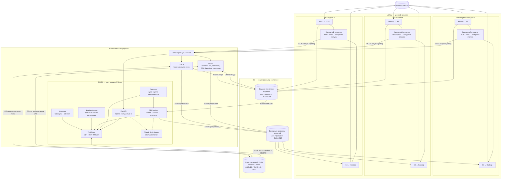
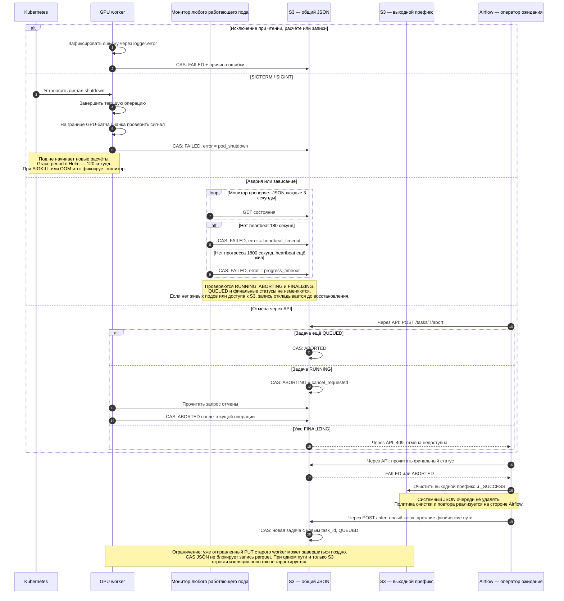
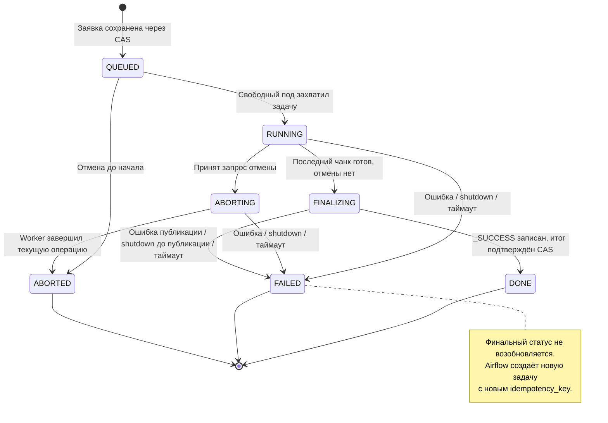

# Архитектура инференса и интеграция с Airflow

Схемы соответствуют текущей реализации сервиса. DAG, перенос Hadoop ↔ S3 и кастомный оператор показаны как целевая интеграция: их код ещё предстоит реализовать. Модели B и N — примеры масштабирования; в текущем YAML настроена credit_cards. Подразумевается, что каждый под загрузил настроенные модели и имеет один GPU worker.

Диаграммы хранятся как код Mermaid в соседней папке `diagrams/`. Диаграммы последовательностей и состояний показывают UML-взаимодействия; первая схема — архитектурная. Изменения исходников можно сравнивать и ревьюить через Git. Каждый `.mmd` — самостоятельный исходник для Mermaid-рендерера; данный Markdown объединяет их для просмотра.

## 1. Архитектура: DAG, Kubernetes и S3

Исходник: [01-architecture.mmd](diagrams/01-architecture.mmd).



## 2. Запуск каждого пода

Исходник: [02-startup.mmd](diagrams/02-startup.mmd).

```mermaid
sequenceDiagram
    autonumber
    participant K as Kubernetes
    participant P as Каждый под
    participant Q as S3 — task_state.json
    participant G as GPU
    K->>P: Запуск контейнера
    P->>P: Получить общий dadm logger
    P->>P: YAML — настройки сервиса; ENV — подключение S3
    P->>Q: GET системного JSON
    alt JSON существует
        Q-->>P: Содержимое + ETag
        P->>P: Проверить структуру, сохранить существующие задачи
    else Объект отсутствует
        P->>Q: PUT пустого JSON, If-None-Match = *
        alt Этот под создал объект
            Q-->>P: 200 OK
        else Другой под успел первым
            Q-->>P: 412 Precondition Failed
            P->>Q: GET существующего JSON
            Q-->>P: Очередь другого пода
        end
    end
    Note over P,Q: Ошибка прав или повреждённый JSON — ошибка старта.<br/>Безусловного PUT для восстановления нет.
    P->>G: Загрузить модели и артефакты на device из YAML
    P->>P: Зарегистрировать SIGTERM / SIGINT
    P->>P: Запустить consumer и отдельный монитор
    P-->>K: Readiness OK
    Note over P,G: Один consumer и не более одного GPU-расчёта на под.<br/>Все API доступны и во время инференса.
```

## 3. Успешный расчёт и конкурентный захват

Исходник: [03-inference.mmd](diagrams/03-inference.mmd).

```mermaid
sequenceDiagram
    autonumber
    participant H as Hadoop / HDFS
    participant A as Airflow — DAG модели
    participant S as S3 — parquet
    participant L as Балансировщик
    participant API as API любого пода
    participant Q as S3 — общий JSON очереди
    participant P1 as Consumer ПОД1
    participant P2 as Consumer ПОД2
    participant W as GPU worker победившего пода
    participant M as Heartbeat и монитор

    Note over H,M: Разные DAG выполняют этот сценарий независимо, с разными model_name и префиксами.
    A->>H: Прочитать исходные данные
    H-->>A: Данные модели
    A->>S: Сохранить входные parquet и _SUCCESS
    A->>L: POST /infer: model_name, пути, idempotency_key
    L->>API: Передать запрос любому поду, включая занятый
    API->>Q: Найти прежнюю задачу по ключу
    alt Такой запрос уже принят
        Q-->>API: Существующий task_id и текущий статус
        API-->>A: 202: прежняя задача, без повторного инференса
    else Новый запрос
        API->>API: Проверить пути и наличие модели
        API->>S: Проверить колонки, число строк и пустой выход
        API->>Q: GET JSON + ETag
        API->>API: Проверить ключ, резервирование выхода и лимит очереди
        API->>Q: PUT If-Match: новая задача QUEUED, revision + 1
        Note over API,Q: При CAS-конфликте — перечитать JSON и заново применить изменение.<br/>После потери ответа PUT — проверить, не сохранён ли уже запрос.
        Q-->>API: Запись подтверждена
        API-->>A: 202: task_id, QUEUED, pod_id = null
    end

    par Свободный ПОД1 опрашивает очередь
        P1->>Q: GET: выбрать старейшую доступную QUEUED
        Q-->>P1: Задача T и ETag X
    and Свободный ПОД2 опрашивает очередь
        P2->>Q: GET: выбрать старейшую доступную QUEUED
        Q-->>P2: Та же задача T и ETag X
    end
    P1->>Q: PUT If-Match X: T → RUNNING, pod_id, owner_id
    Q-->>P1: 200 — захват подтверждён
    P2->>Q: PUT If-Match X: попытка забрать T
    Q-->>P2: 412 — версия уже изменилась
    P2->>Q: Перечитать очередь и выбрать другую задачу
    Note over P1,P2: ПОД1 — победитель только в этом примере.<br/>Занятый consumer не забирает следующую задачу.
    P1->>W: Запустить задачу T
    W->>S: Повторно проверить пустой выходной префикс

    par Выполнение инференса
        loop Для каждого входного чанка
            W->>S: Прочитать чанк parquet
            W->>Q: Проверить статус, владельца, таймаут и отмену
            loop Для каждого GPU-батча внутри чанка
                W->>W: Проверить shutdown / сигнал потери задачи
                W->>W: Препроцессинг → GPU forward → калибрация
                W->>W: Проверить shutdown после батча
            end
            W->>Q: Проверить задачу перед записью
            W->>S: Записать part-N.parquet
            opt Настало время обновления прогресса
                W->>Q: CAS: processed_rows, время инференса, updated_at
            end
        end
    and Обслуживание очереди
        loop Heartbeat каждые 30 секунд, пока worker работает
            M->>Q: CAS: обновить heartbeat активной задачи
        end
        Note over M,Q: Монитор каждого пода проверяет таймауты каждые 3 секунды.<br/>Просроченные активные задачи → FAILED.<br/>Retention очищает старые завершённые записи из того же JSON.
    and Кастомный оператор ждёт результат
        loop До финального статуса
            A->>L: GET /tasks/T/status
            L->>API: Запрос может попасть на другой под
            API->>Q: GET общего JSON
            Q-->>API: Статус, прогресс, ETA, error
            API-->>A: Текущее состояние задачи
        end
    end

    W->>Q: CAS: последняя проверка отмены → FINALIZING
    Note over W,Q: Если отмена уже принята — ABORTED, _SUCCESS не публикуется.<br/>Если задача просрочена — FAILED, завершение запрещено.
    W->>S: Сохранить _SUCCESS
    W->>Q: CAS: FINALIZING → DONE
    Note over W,Q: При временной ошибке S3 повторяется сохранение статуса.<br/>Инференс повторно не запускается; существующий FAILED не заменяется.
    A->>L: GET /tasks/T/status
    L->>API: Прочитать итог
    API->>Q: GET
    Q-->>API: DONE
    API-->>A: DONE
    A->>S: Следующая таска читает выходные parquet
    S-->>A: Рассчитанные данные
    A->>H: Записать результат обратно в Hadoop
```

## 4. Ошибки, shutdown, отмена и повтор

Исходник: [04-failures.mmd](diagrams/04-failures.mmd).



## 5. Жизненный цикл одной задачи

Исходник: [05-task-states.mmd](diagrams/05-task-states.mmd).



## Контракт и ограничения

- Ответ 202 означает сохранение заявки, а не завершение расчёта. Повтор того же HTTP-запроса использует прежний ключ; новый расчёт после FAILED использует новый ключ.
- Ошибки валидации дают 404/422, конфликт ключа, выходного префикса или лимита очереди — 409, ошибка доступа к хранилищу — 503. Не каждый HTTP 409 означает CAS-конфликт: CAS-конфликты сервис обрабатывает внутри.
- JSON очереди обновляется через GET содержимого и ETag одного объекта → изменение → PUT If-Match. В используемом S3 ETag передаётся без кавычек. При отсутствии изменений PUT не выполняется.
- Значения на схемах взяты из configs/models.yaml: polling 3 с, heartbeat 30 с, heartbeat timeout 180 с, progress timeout 1800 с, обновление прогресса не чаще 10 с, cleanup 3600 с, retention 6 месяцев по 30 суток. Монитор и heartbeat используют разные потоки; lane объединена только для компактности диаграммы.
- Успешный sequence предполагает отсутствие ошибки, отмены и таймаута до фиксации DONE. Ошибочные альтернативы подробно вынесены в отдельную схему.
- После подтверждённой публикации _SUCCESS worker сохраняет DONE; если монитор уже записал FAILED, вернуть DONE нельзя. S3-результат и JSON не составляют общей транзакции.
- Одинаковый физический выходной путь сохраняется по принятому контракту. Очистка и повтор после таймаута не имеют строгой защиты от позднего PUT старого пода. Сервис проверяет статус перед записью и сигнал остановки между GPU-батчами, но не отменяет запрос, уже принятый S3.
- Перенос из S3 обратно в Hadoop запускается только после DONE. Финальные FAILED/ABORTED сами по себе не возвращают задачу в очередь: повтор инициирует Airflow.
