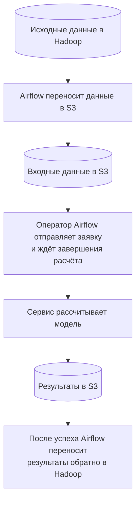
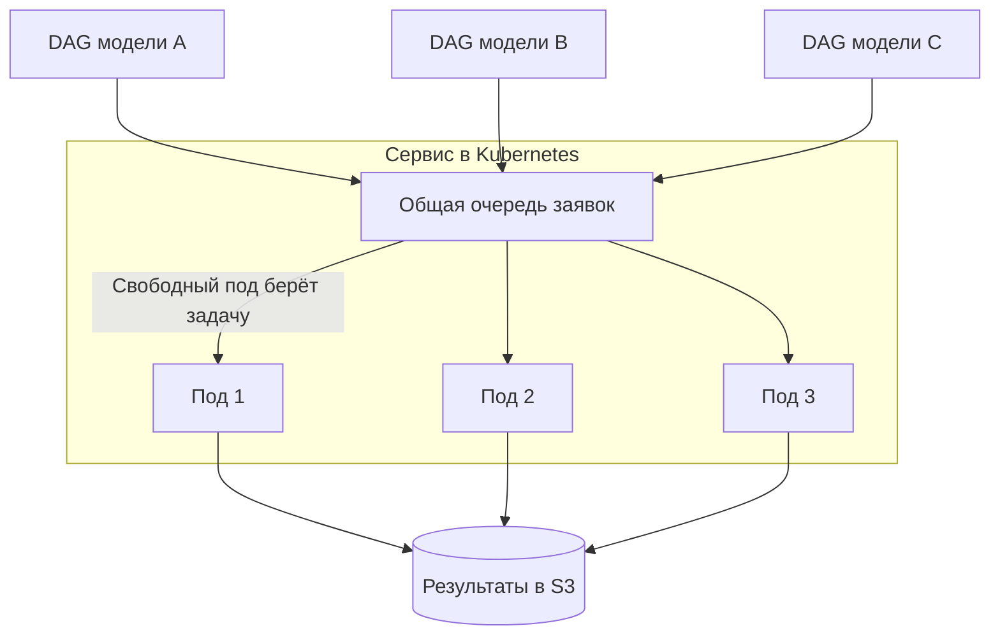
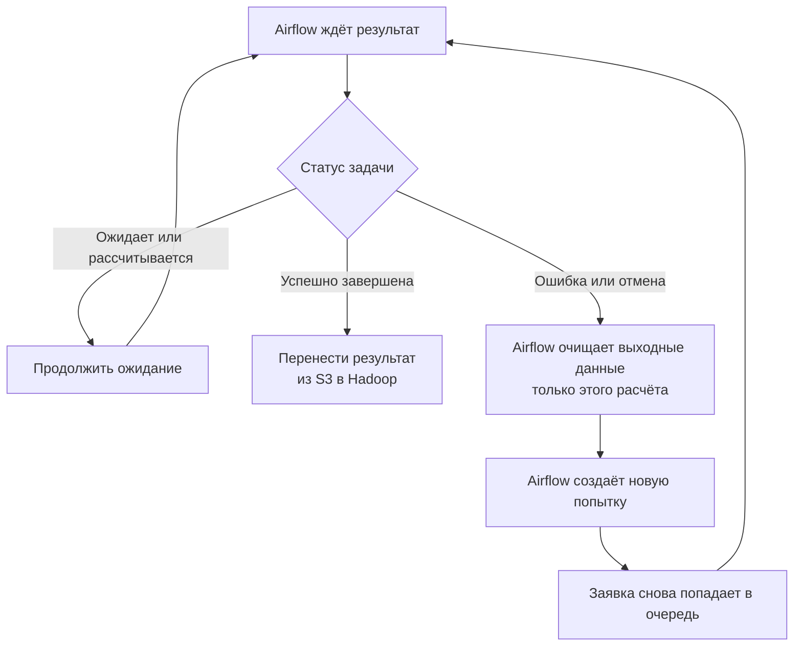

# Как работает сервис расчёта моделей

Сервис получает подготовленные данные из S3, рассчитывает модель и сохраняет результат туда же. Airflow управляет всем процессом: переносом данных из Hadoop, запуском расчёта, ожиданием и возвратом результата.

Схемы показывают планируемую интеграцию Airflow с текущим сервисом. Кастомный оператор и DAG ещё предстоит реализовать. Для каждой модели предполагается свой DAG — последовательность задач Airflow.

## 1. Путь данных

Следующая задача Airflow забирает результат только после успешного завершения расчёта.

[Исходник диаграммы](diagrams/01-architecture.mmd).

## 2. Как распределяются расчёты

Под — отдельный экземпляр сервиса. Каждый под выполняет один расчёт за раз. Несколько подов могут считать разные модели одновременно. Если все заняты, новые заявки ждут в очереди.

[Исходник диаграммы](diagrams/03-inference.mmd).

## 3. Успех, ошибка и повтор

Сервис сам отмечает ошибку при сбое, остановке пода или длительном отсутствии сигналов работы. Новую попытку запускает Airflow. Повтор выполняется с начала.

[Исходник диаграммы](diagrams/04-failures.mmd).

## Что означают статусы

| Статус | Что происходит |
| --- | --- |
| QUEUED | Заявка принята и ждёт свободный под. |
| RUNNING | Выполняется расчёт. |
| FINALIZING | Сервис завершает сохранение результата. Нужно подождать. |
| DONE | Расчёт успешен. Airflow может забирать результат. |
| ABORTING | Получен запрос отмены. Сервис останавливает расчёт. |
| ABORTED | Расчёт отменён. |
| FAILED | Расчёт завершён с ошибкой. Причина указана в статусе задачи. |

## Что важно для поддержки

- При запуске под сначала загружает модели, затем начинает принимать и выполнять задачи.
- QUEUED при занятых подах — нормальное ожидание, а не ошибка.
- Сервис проверяет доступность исполнителя и движение расчёта. Сейчас ошибка выставляется после 3 минут без сигнала от исполнителя либо 30 минут без обновления прогресса. Эти интервалы настраиваются.
- При остановке пода расчёт прерывается на ближайшей проверке и получает FAILED. После аварийного выключения ошибку обнаруживает другой работающий под или сервис после восстановления.
- При повторе очищаются только выходные данные конкретного расчёта. Весь бакет S3 очищать нельзя: там также хранится общая очередь.
- После ошибки по таймауту старая запись в S3 иногда может завершиться с задержкой. При повторе в ту же папку это создаёт риск смешивания результатов разных попыток.

## Редактирование

Все три схемы сохранены как текстовые файлы Mermaid (.mmd) в папке diagrams. Их можно редактировать как код и хранить в Git.
