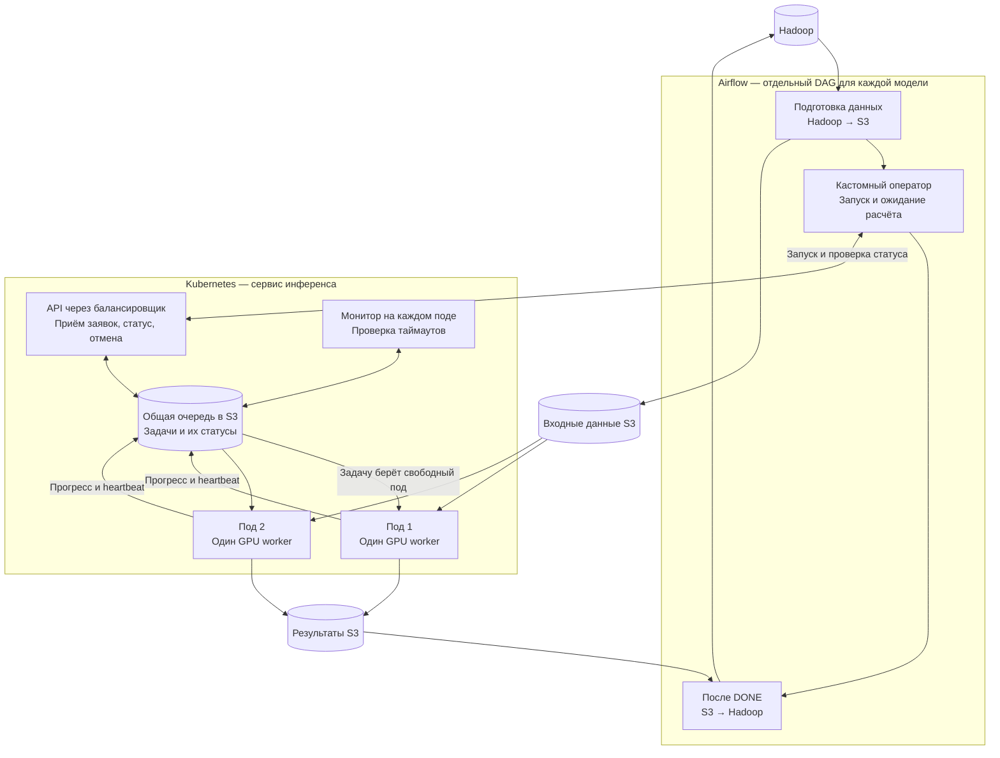
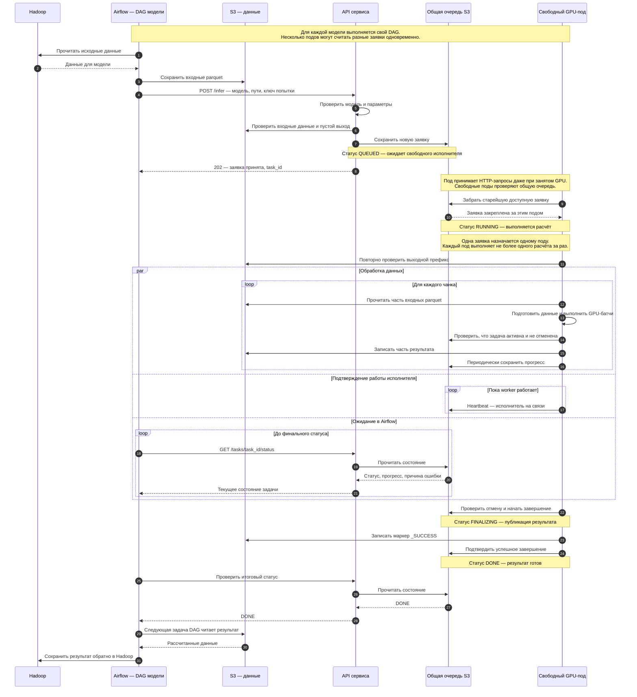
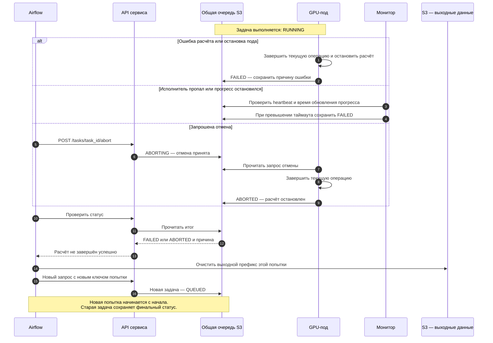
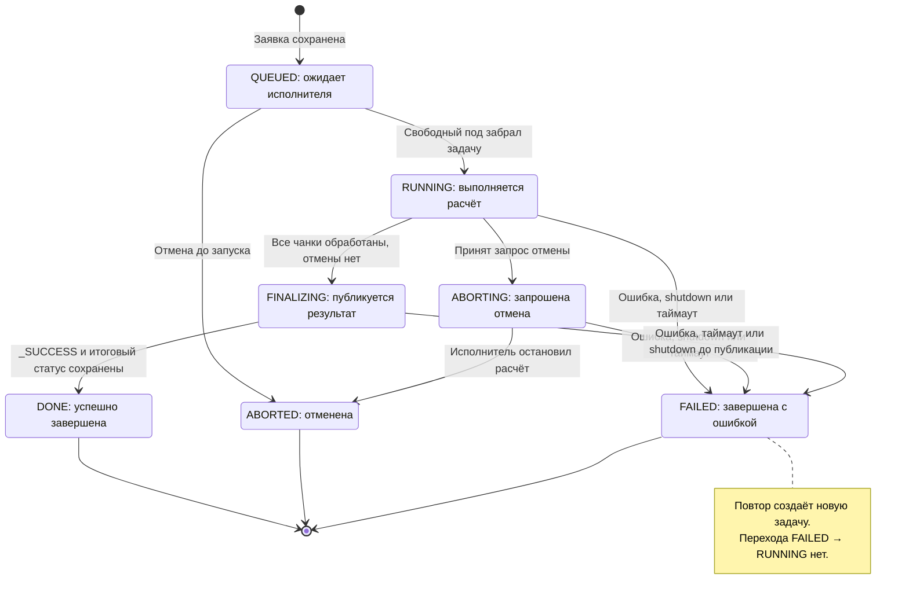

# Работа сервиса инференса: архитектура, последовательность и статусы

Диаграммы предназначены для аналитиков, поддержки и технических специалистов.
Airflow подготавливает данные и управляет запуском, сервис выполняет GPU-расчёт,
S3 хранит вход, выход и общую очередь.

Сервис уже реализован. DAG, перенос Hadoop ↔ S3 и кастомный оператор показаны
как целевая интеграция, которую ещё предстоит реализовать. У каждой модели
свой DAG, но очередь и поды общие.

## 1. Общая архитектура

После старта под загружает настроенные модели. Затем API принимает заявки, свободный worker забирает расчёты, а отдельный монитор следит за таймаутами. Очередь физически хранится в S3 — на схеме она включена в границу сервиса как его общий компонент.

[Исходник диаграммы](diagrams/01-architecture.mmd).

## 2. Успешный расчёт — UML sequence

Показан путь одной новой заявки без ошибок и отмены. Балансировщик может направить каждый запрос на любой под. Ответ 202 подтверждает приём заявки, а DONE — завершение расчёта.

[Исходник диаграммы](diagrams/03-inference.mmd).

## 3. Ошибка, отмена и повтор — UML sequence

Показаны альтернативы для выполняющейся задачи. Отмена ожидающей заявки сразу даёт ABORTED. После перехода в FINALIZING запрос отмены отклоняется — публикация уже началась.

[Исходник диаграммы](diagrams/04-failures.mmd).

## 4. Переходы статусов — UML state

Это жизненный цикл одной задачи. Повтор Airflow создаёт другой task_id и начинает новый жизненный цикл с QUEUED.

[Исходник диаграммы](diagrams/05-task-states.mmd).

## Правила, важные при сопровождении

- **Очередь общая.** Одновременные обращения подов согласуются через условное обновление одного файла. Занятость пода не мешает ему принять новую заявку.
- **Повтор запроса и повтор расчёта различаются.** После потери HTTP-ответа Airflow использует прежний ключ и получает прежнюю задачу. После FAILED или ABORTED новый расчёт получает новый ключ.
- **Heartbeat и прогресс проверяются отдельно.** Сейчас heartbeat отправляется каждые 30 секунд, монитор проверяет очередь каждые 3 секунды. Отсутствие heartbeat 180 секунд или прогресса 1800 секунд приводит к FAILED. Интервалы задаются в YAML.
- **Shutdown проверяется между GPU-батчами и операциями.** При сигнале остановки под прекращает забирать заявки, а worker сохраняет FAILED с причиной pod_shutdown. Уже начатый вызов GPU или S3 не прерывается мгновенно. При аварийном выключении статус обновит работающий монитор после таймаута.
- **Публикация идёт по порядку: части результата → _SUCCESS → DONE.** При проблемах сохранения DONE worker повторяет запись статуса, а не весь расчёт. Если монитор уже выставил FAILED, поздний DONE его не заменяет.
- **Повторы используют те же физические пути.** Airflow очищает только выходной префикс расчёта, сохраняя системный файл очереди. После таймаута остаётся риск поздней записи старого пода в этот путь. Строгая изоляция попыток при текущих ограничениях не гарантируется.
- **История сохраняется.** Монитор удаляет из очереди только старые завершённые записи по сроку хранения. Ожидающие заявки не теряются из-за возраста.

Диаграммы сохранены как редактируемые исходники Mermaid (.mmd).
