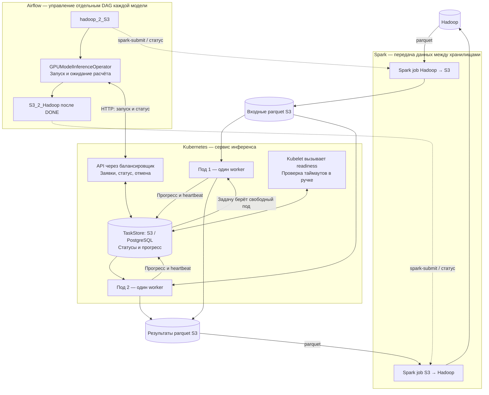
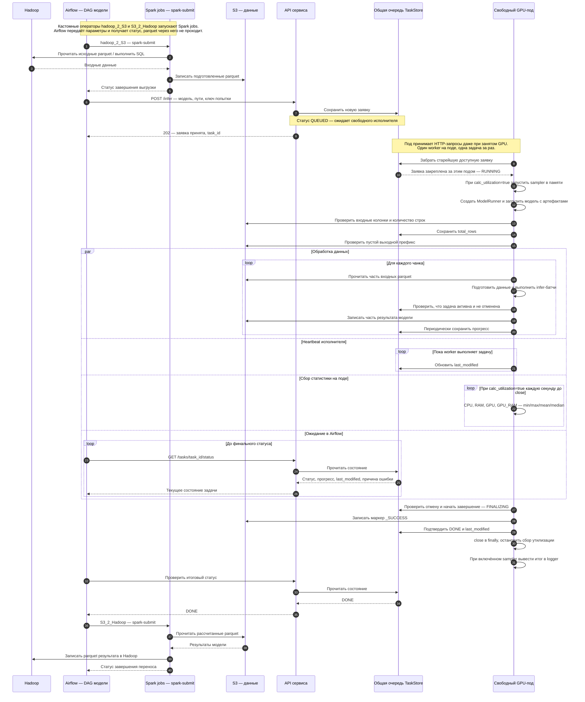
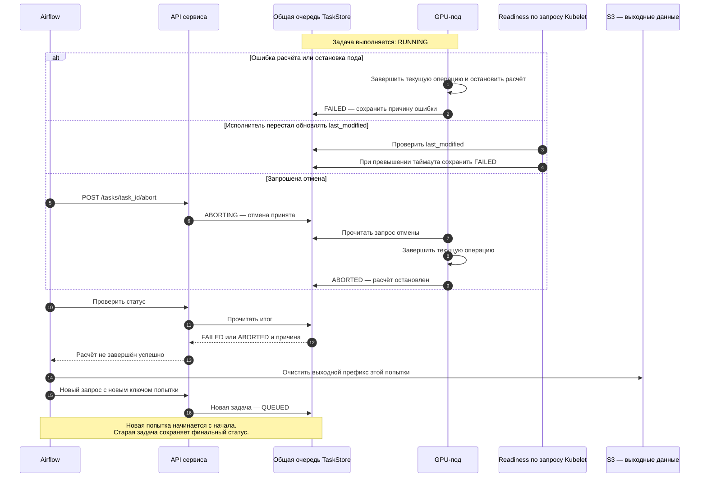
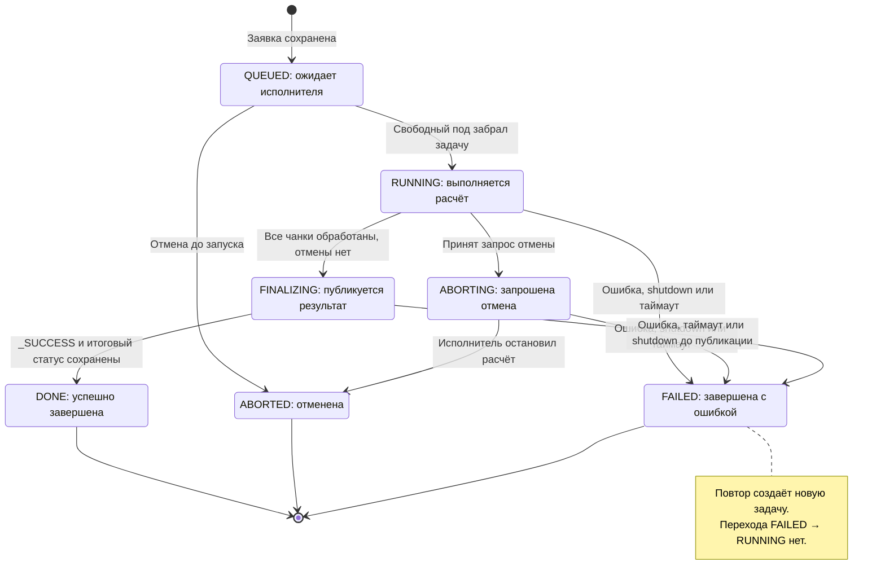

# Работа сервиса инференса: архитектура, последовательность и статусы

Диаграммы предназначены для аналитиков, поддержки и технических специалистов.
Airflow управляет запуском Spark jobs и инференса; сервис выполняет GPU-расчёт,
S3 хранит вход и выход; общая очередь использует S3 или PostgreSQL.

В кастомной библиотеке уже есть операторы hadoop_2_S3 и S3_2_Hadoop:
через spark-submit они запускают Spark jobs, читающие parquet из одного хранилища
и записывающие в другое. Данные не проходят через Airflow workers или XCom.
У каждой модели свой DAG, очередь и поды общие. TaskStore использует backend S3 или PostgreSQL;
Выбор задаётся в YAML: `task_store.backend: s3` или `pg`.

## 1. Общая архитектура

При старте под вызывает заглушку скачивания артефактов; веса загружает worker только после захвата задачи. Затем API принимает заявки, свободный worker забирает расчёты, а readiness-запросы Kubernetes запускают проверку таймаутов. Очередь физически хранится в выбранном backend — на схеме она включена в границу сервиса как его общий компонент.

[Исходник диаграммы](diagrams/01-architecture.mmd).

## 2. Успешный расчёт — UML sequence

Показан путь одной новой заявки без ошибок и отмены. Балансировщик может направить каждый запрос на любой под. Ответ 202 подтверждает приём заявки, а DONE — завершение расчёта.

[Исходник диаграммы](diagrams/03-inference.mmd).

## 3. Ошибка, отмена и повтор — UML sequence

Показаны альтернативы для выполняющейся задачи. Отмена ожидающей заявки сразу даёт ABORTED. После перехода в FINALIZING запрос отмены отклоняется — публикация уже началась.

[Исходник диаграммы](diagrams/04-failures.mmd).

## 4. Переходы статусов — UML state

Это жизненный цикл одной задачи. Повтор Airflow создаёт другой task_id и начинает новый жизненный цикл с QUEUED.

[Исходник диаграммы](diagrams/05-task-states.mmd).

## Правила, важные при сопровождении

- **Очередь общая.** S3 согласует изменения через CAS одного JSON, PostgreSQL — транзакцией с блокировкой таблицы. Занятость пода не мешает ему принять новую заявку.
- **Повтор запроса и повтор расчёта различаются.** После потери HTTP-ответа Airflow использует прежний ключ и получает прежнюю задачу. После FAILED или ABORTED новый расчёт получает новый ключ.
- **Таймаут по last_modified.** Heartbeat обновляет время каждые 30 секунд. Readiness запускает проверку очереди; отсутствие обновлений 1800 секунд приводит к FAILED. Поток monitor_queue удалён.
- **Shutdown проверяется между GPU-батчами и операциями.** При сигнале остановки под прекращает забирать заявки, а worker сохраняет FAILED с причиной pod_shutdown. Уже начатый вызов GPU или S3 не прерывается мгновенно. При аварийном выключении статус обновит обработчик readiness после таймаута.
- **Публикация идёт по порядку: части результата → _SUCCESS → DONE.** При проблемах сохранения DONE worker повторяет запись статуса, а не весь расчёт. Если проверка таймаута уже выставила FAILED, поздний DONE его не заменяет.
- **Повторы используют те же физические пути.** Airflow очищает только выходной префикс расчёта, сохраняя системный файл очереди. После таймаута остаётся риск поздней записи старого пода в этот путь. Строгая изоляция попыток при текущих ограничениях не гарантируется.
- **История сохраняется.** Readiness удаляет старые завершённые записи только в S3; PG не очищает историю. Ожидающие заявки не теряются из-за возраста.

Диаграммы сохранены как редактируемые исходники Mermaid (.mmd).
